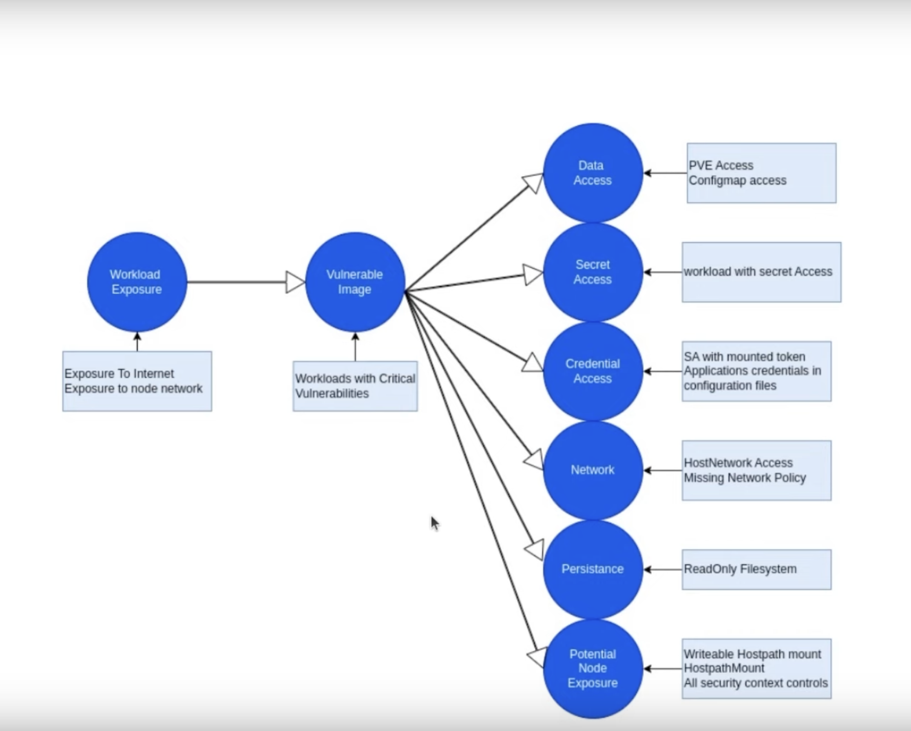
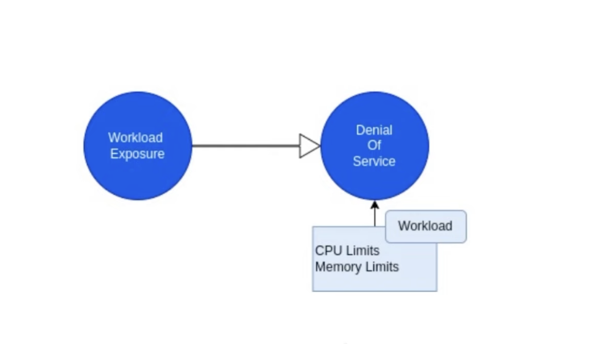

## Optimizing breaking attack chains 
Link: https://www.youtube.com/watch?v=bzz1oh1WgZg&t=11s

### What is Attach chains
- Serious missconfiguration or vulnerabilities that a malicious actor can exploit to access and manipulate your environments
- Each chain represents some exploitable risk you have in your system and together they create a whole chain or a path.
- From attacker's perspective, the chain is only as a strong as its weakest link
- So in order to break a chain we would only to fix the risks on a specific link in a chain

### Attack paths in ARMO
- First path

- Second path

### Demo in ARMO
- https://www.armosec.io/watch-a-demo/

### Summary
- What is an attack chain
- How attack chains help prioritize security work
- An attack chain is only strong as its weakest link